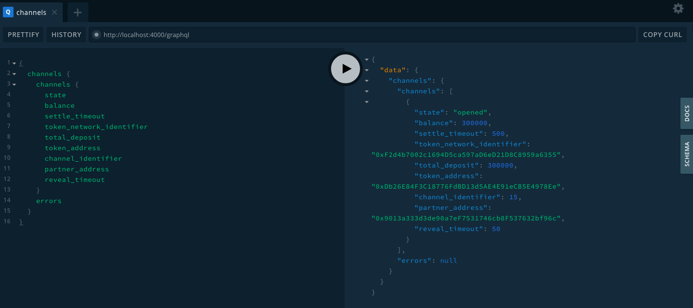

# Raiden Network + GraphQL = "🚀🚀🚀🚀🚀🚀🚀🚀"
For the [Grow Ethereum](https://gitcoin.co/blog/growethereum/?fbclid=IwAR0eiIY_PiJl1i8iz2mfgGb1uvZnlgDignX402uLC7u2VKniMMlnGoggW5Y) hackathon runs from Jul 29, 2019 - Aug 15, 2019 as the 3th round of the [Gitcoin's Ethereum Virtual Hackathon](https://gitcoin.co/hackathon/ethereal-virtual-hackathon/), this project is expecting to provide a new interface for [Raiden Network](https://raiden.network/) other than original design a RESTful API. Raiden network is designed to provide a fast, cheap, scablable tokens transfer for Ethereum, that will be much more useful if we can provide a GraphQL API interface for the mobile apps which came from this work. Please enjoy it.

## build and run for dev
```
yarn
yarn dev
```
or
```
npm install
npm run dev
```

## run for prod
```
yarn start
```
or
```
npm run start
```
then, you can use GraphQL UI to explorer your raiden node on 🚀 Server ready at http://localhost:4000/graphql

## enviornment setting (test only on the Ropsten network with Raiden 0.100.3)
geth
```
geth --cache=500000 --syncmode=fast --testnet --rpc --rpcapi eth,net,web3,txpool --bootnodes enode://20c9ad97c081d63397d7b685a412227a40e23c8bdc6688c6f37e97cfbc22d2b4d1db1510d8f61e6a8866ad7f0e17c02b14182d37ea7c3c8b9c2683aeb6b733a1@52.169.14.227:30303,enode://6ce05930c72abc632c58e2e4324f7c7ea478cec0ed4fa2528982cf34483094e9cbc9216e7aa349691242576d552a2a56aaeae426c5303ded677ce455ba1acd9d@13.84.180.240:30303 --rpcaddr 0.0.0.0
```
raiden node
```
./raiden --keystore-path  ~/.ethereum/testnet/keystore --network-id ropsten --eth-rpc-endpoint http://localhost:8545 --environment-type development --password-file /tmp/passwd --accept-disclaimer --address 0xd2C73673E8C0a13400c7136495dA6fab31618902
```
To change your BASE_URL in axiosInstance.js, if this code is not run on the same server as the raiden node.
```
const axios = require('axios')

// default BASE_URL should be "http:localhost:5001" where localhost is running the raiden node.

const BASE_URL = "http://localhost:5001"
const instance = axios.create({
  baseURL: BASE_URL+'/api/v1/'
})

module.exports = instance
```

# GraphQL command examples
## address
query:
```
{
  address {
    our_address
  }
}
```
return:
```
{
  "data": {
    "address": {
      "our_address": "0xd2C73673E8C0a13400c7136495dA6fab31618902"
    }
  }
}
```
## tokens
```
{
  tokens
}
```
return:
```
{
  "data": {
    "tokens": [
      "0xD5B3df30512d846A7CB6B4154C066031D837ac60",
      "0x0f114A1E9Db192502E7856309cc899952b3db1ED",
      "0x5422Ef695ED0B1213e2B953CFA877029637D9D26",
      "0x26d5a400C4AeB84FAE923470350EeC3EA6423c78",
      "0x2A07C1D3bc08c183fE4ec5b51f5BfBd5Fe598BDc",
      "0x9aBa529db3FF2D8409A1da4C9eB148879b046700",
      "0xc778417E063141139Fce010982780140Aa0cD5Ab",
      "0x4F209f92F5cDE44FFF98C0b0CA486B14424e2834",
      "0x101848D5C5bBca18E6b4431eEdF6B95E9ADF82FA",
      "0xDb26E84F3C18776FdBD13d5AE4E91eCB5E4978Ee"
    ]
  }
}
```
## Registering a token
```
mutation {
  token(address: "0xbFF1B20483EC5D24509D8F49F888d3D21921FCF5") {
    errors
    token_network_address
  }
}
```
return:
```
{
  "data": {
    "token": {
      "errors": null,
      "token_network_address": "0x934C75Aa24c4988D4Fd72c39e766110422b6779E"
    }
  }
}
```
or if token already regiestered.
```
{
  "data": {
    "token": {
      "errors": [
        "Token already registered"
      ],
      "token_network_address": null
    }
  }
}
```
or if address is not EIP55 compliance.
```
{
  "data": {
    "token": {
      "errors": [
        "invalid endpoint",
        "Not a valid EIP55 encoded address."
      ],
      "token_network_address": null
    }
  }
}
```
check all tokens again, see "0xbFF1B20483EC5D24509D8F49F888d3D21921FCF5" is registered.
```
{
  tokens
}
```
return:
```
{
  "data": {
    "tokens": [
      "0xD5B3df30512d846A7CB6B4154C066031D837ac60",
      "0x0f114A1E9Db192502E7856309cc899952b3db1ED",
      "0x5422Ef695ED0B1213e2B953CFA877029637D9D26",
      "0x26d5a400C4AeB84FAE923470350EeC3EA6423c78",
      "0x2A07C1D3bc08c183fE4ec5b51f5BfBd5Fe598BDc",
      "0x9aBa529db3FF2D8409A1da4C9eB148879b046700",
      "0xc778417E063141139Fce010982780140Aa0cD5Ab",
      "0x4F209f92F5cDE44FFF98C0b0CA486B14424e2834",
      "0x101848D5C5bBca18E6b4431eEdF6B95E9ADF82FA",
      "0xDb26E84F3C18776FdBD13d5AE4E91eCB5E4978Ee",
      "0xbFF1B20483EC5D24509D8F49F888d3D21921FCF5"
    ]
  }
}
```
# channels

## GET get channel status
```
{
  channels(token_address: "0xDb26E84F3C18776FdBD13d5AE4E91eCB5E4978Ee") {
    channels {
      total_deposit
      state
      partner_address
      token_address
      token_network_identifier
    }
    errors
  }
}
```
return:
```
{
  "data": {
    "channels": {
      "channels": [
        {
          "total_deposit": 1000,
          "state": "opened",
          "partner_address": "0x9013a333d3de90a7eF7531746cb8F537632bf96c",
          "token_address": "0xDb26E84F3C18776FdBD13d5AE4E91eCB5E4978Ee",
          "token_network_identifier": "0xF2d4b7002c1694D5ca597aD6eD21D8C8959a6355"
        }
      ],
      "errors": null
    }
  }
}
```
or with no token_address
```
{
  channels {
    channels {
      state
      balance
      settle_timeout
      token_network_identifier
      total_deposit
      token_address
      channel_identifier
      partner_address
      reveal_timeout
    }
    errors
  }
}
```
return:
```
{
  "data": {
    "channels": {
      "channels": [
        {
          "state": "opened",
          "balance": 1000,
          "settle_timeout": 500,
          "token_network_identifier": "0xF2d4b7002c1694D5ca597aD6eD21D8C8959a6355",
          "total_deposit": 1000,
          "token_address": "0xDb26E84F3C18776FdBD13d5AE4E91eCB5E4978Ee",
          "channel_identifier": 5,
          "partner_address": "0x9013a333d3de90a7eF7531746cb8F537632bf96c",
          "reveal_timeout": 50
        }
      ],
      "errors": null
    }
  }
}
```
or with error
```
{
  channels (token_address: "asdf") {
    errors
  }
}
```
return:
```
{
  "data": {
    "channels": {
      "errors": [
        "invalid endpoint",
        "Not a valid hex address, 0x prefix missing."
      ]
    }
  }
}
```
## deposit a channel
```
mutation {
  channel_deposit(
    token_address: "0xDb26E84F3C18776FdBD13d5AE4E91eCB5E4978Ee"
    partner_address: "0x9013a333d3de90a7eF7531746cb8F537632bf96c"
    total_deposit: 300000
  ) {
    channels {
      state
      balance
      settle_timeout
      token_network_identifier
      total_deposit
      token_address
      channel_identifier
      partner_address
      reveal_timeout
    }
    errors
  }
}
```
return:
```
{
channels: [
{ state: 'opened',
  balance: 10000,
  settle_timeout: 500,
  token_network_identifier: '0xF2d4b7002c1694D5ca597aD6eD21D8C8959a6355',
  total_deposit: 300000,
  token_address: '0xDb26E84F3C18776FdBD13d5AE4E91eCB5E4978Ee',
  channel_identifier: 5,
  partner_address: '0x9013a333d3de90a7eF7531746cb8F537632bf96c',
  reveal_timeout: 50 }
]
errors: null
}
```
## create (open) a channel 
```
mutation {
  channel(
    token_address: "0xDb26E84F3C18776FdBD13d5AE4E91eCB5E4978Ee"
    partner_address: "0x9013a333d3de90a7eF7531746cb8F537632bf96c"
    settle_timeout: 500
    total_deposit: 1337
  ) {
    errors
  }
}
```
with error
```
{
  "data": {
    "channel": {
      "channels": null,
      "errors": [
        "Channel with given partner address already exists"
      ]
    }
  }
}
```
## close a channel 
This request is used to close a channel or to increase the deposit in it.
with "state": "closed"
```
mutation {
  channel_close(
    token_address: "0xDb26E84F3C18776FdBD13d5AE4E91eCB5E4978Ee"
    partner_address: "0x9013a333d3de90a7eF7531746cb8F537632bf96c"
  ) {
    channels {
      state
    }
    errors
  }
}
```
return:
```
{
  "data": {
    "channel_close": {
      "channels": [
        {
          "state": "closed"
        }
      ],
      "errors": null
    }
  }
}
```
or with error
```
{
  "data": {
    "channel_close": {
      "channels": null,
      "errors": [
        "Attempted to close an already closed channel"
      ]
    }
  }
}
```

## withdraw a channel 
This request is used to close a channel or to increase the deposit in it.
with "total_withdraw": 100 
```
mutation {
  channel_withdraw(
    token_address: "0xDb26E84F3C18776FdBD13d5AE4E91eCB5E4978Ee"
    partner_address: "0x9013a333d3de90a7eF7531746cb8F537632bf96c"
    total_withdraw: 300
  ) {
    channels {
      state
      balance
      settle_timeout
      token_network_identifier
      total_deposit
      token_address
      channel_identifier
      partner_address
      reveal_timeout
    }
    errors
  }
}
```
return in 0.100.3 (not implemented yet)
```
{ errors:
   'Nothing to do. Should either provide \'total_deposit\' or \'state\' argument' }
```

## pending_transfers
```
{
  pending_transfers(
    token_address: "0xDb26E84F3C18776FdBD13d5AE4E91eCB5E4978Ee"
    partner_address: "0x9013a333d3de90a7eF7531746cb8F537632bf96c"
  ) {
    transfers {
      channel_identifier
      payment_identifier
      token_address
      token_network_identifier
      initiator
      channel_identifier
      target
      locked_amount
      role
      transferred_amount
    }
    errors
  }
}
```
return:
```
{
  "data": {
    "pending_transfers": {
      "transfers": [],
      "errors": null
    }
  }
}
```
or with data
```
{
  "data": {
    "pending_transfers": {
      "transfers": [
        {
          "channel_identifier": "6",
          "payment_identifier": "14164638209489862054",
          "token_address": "0xDb26E84F3C18776FdBD13d5AE4E91eCB5E4978Ee",
          "token_network_identifier": "0xF2d4b7002c1694D5ca597aD6eD21D8C8959a6355",
          "initiator": "0xd2C73673E8C0a13400c7136495dA6fab31618902",
          "target": "0x9013a333d3de90a7eF7531746cb8F537632bf96c",
          "locked_amount": "300",
          "role": "initiator",
          "transferred_amount": "0"
        },
        {
          "channel_identifier": "6",
          "payment_identifier": "15669887581632066647",
          "token_address": "0xDb26E84F3C18776FdBD13d5AE4E91eCB5E4978Ee",
          "token_network_identifier": "0xF2d4b7002c1694D5ca597aD6eD21D8C8959a6355",
          "initiator": "0xd2C73673E8C0a13400c7136495dA6fab31618902",
          "target": "0x9013a333d3de90a7eF7531746cb8F537632bf96c",
          "locked_amount": "600",
          "role": "initiator",
          "transferred_amount": "0"
        },
        {
          "channel_identifier": "6",
          "payment_identifier": "1829131590973794013",
          "token_address": "0xDb26E84F3C18776FdBD13d5AE4E91eCB5E4978Ee",
          "token_network_identifier": "0xF2d4b7002c1694D5ca597aD6eD21D8C8959a6355",
          "initiator": "0xd2C73673E8C0a13400c7136495dA6fab31618902",
          "target": "0x9013a333d3de90a7eF7531746cb8F537632bf96c",
          "locked_amount": "1000",
          "role": "initiator",
          "transferred_amount": "0"
        }
      ],
      "errors": null
    }
  }
}
```

# connections
## list connections
```
{
  connections {
    token_address
    funds
    sum_deposits
    channels
  }
}
```
return:
```
{
  "data": {
    "connections": [
      {
        "token_address": "0xDb26E84F3C18776FdBD13d5AE4E91eCB5E4978Ee",
        "funds": 3000,
        "sum_deposits": 1200,
        "channels": 2
      }
    ]
  }
}
```
or with no any connection
```
{
  "data": {
    "connections": []
  }
}
```
## create connection with funds
```
mutation {
  connection (token_address: "0xDb26E84F3C18776FdBD13d5AE4E91eCB5E4978Ee"
  funds: 999999) {
    errors
  }
}
```
return:
```
{
  "data": {
    "connection": {
      "errors": [
        "204 NO CONTENT"
      ]
    }
  }
}

```
## leave connection
```
mutation {
  leave_connection (token_address: "0xDb26E84F3C18776FdBD13d5AE4E91eCB5E4978Ee"
  )
}
```
return:
```
{
  "error": "Failed to fetch. Please check your connection"
}
```
# Payments

## querying payments events

```
{
  payments(
    token_address: "0xDb26E84F3C18776FdBD13d5AE4E91eCB5E4978Ee"
    target_address: "0x9013a333d3de90a7eF7531746cb8F537632bf96c"
  ) {
    target
    reason
    log_time
    event
  }
}
```
return:
```
{
  "data": {
    "payments": [
      {
        "target": "0x9013a333d3de90a7eF7531746cb8F537632bf96c",
        "reason": "lock expired",
        "log_time": "2019-08-06T06:31:02.280",
        "event": "EventPaymentSentFailed"
      },
      {
        "target": "0x9013a333d3de90a7eF7531746cb8F537632bf96c",
        "reason": "lock expired",
        "log_time": "2019-08-06T07:00:53.490",
        "event": "EventPaymentSentFailed"
      },
      {
        "target": "0x9013a333d3de90a7eF7531746cb8F537632bf96c",
        "reason": "there is no route available",
        "log_time": "2019-08-07T06:34:12.641",
        "event": "EventPaymentSentFailed"
      },
      {
        "target": "0x9013a333d3de90a7eF7531746cb8F537632bf96c",
        "reason": "none of the available routes could be used",
        "log_time": "2019-08-07T06:50:26.944",
        "event": "EventPaymentSentFailed"
      },
      {
        "target": "0x9013a333d3de90a7eF7531746cb8F537632bf96c",
        "reason": "none of the available routes could be used",
        "log_time": "2019-08-07T06:51:54.656",
        "event": "EventPaymentSentFailed"
      },
      {
        "target": "0x9013a333d3de90a7eF7531746cb8F537632bf96c",
        "reason": "there is no route available",
        "log_time": "2019-08-07T07:10:57.260",
        "event": "EventPaymentSentFailed"
      },
      {
        "target": "0x9013a333d3de90a7eF7531746cb8F537632bf96c",
        "reason": "there is no route available",
        "log_time": "2019-08-13T10:47:59.794",
        "event": "EventPaymentSentFailed"
      },
      {
        "target": "0x9013a333d3de90a7eF7531746cb8F537632bf96c",
        "reason": "lock expired",
        "log_time": "2019-08-13T11:35:59.023",
        "event": "EventPaymentSentFailed"
      },
      {
        "target": "0x9013a333d3de90a7eF7531746cb8F537632bf96c",
        "reason": "lock expired",
        "log_time": "2019-08-13T11:38:14.340",
        "event": "EventPaymentSentFailed"
      },
      {
        "target": "0x9013a333d3de90a7eF7531746cb8F537632bf96c",
        "reason": "lock expired",
        "log_time": "2019-08-13T11:42:07.955",
        "event": "EventPaymentSentFailed"
      },
      {
        "target": "0x9013a333d3de90a7eF7531746cb8F537632bf96c",
        "reason": "lock expired",
        "log_time": "2019-08-13T11:56:34.858",
        "event": "EventPaymentSentFailed"
      },
      {
        "target": "0x9013a333d3de90a7eF7531746cb8F537632bf96c",
        "reason": "lock expired",
        "log_time": "2019-08-13T11:58:18.970",
        "event": "EventPaymentSentFailed"
      },
      {
        "target": "0x9013a333d3de90a7eF7531746cb8F537632bf96c",
        "reason": "there is no route available",
        "log_time": "2019-08-13T13:54:04.834",
        "event": "EventPaymentSentFailed"
      },
      {
        "target": "0x9013a333d3de90a7eF7531746cb8F537632bf96c",
        "reason": "lock expired",
        "log_time": "2019-08-13T14:40:23.528",
        "event": "EventPaymentSentFailed"
      },
      {
        "target": "0x9013a333d3de90a7eF7531746cb8F537632bf96c",
        "reason": "lock expired",
        "log_time": "2019-08-13T14:44:14.159",
        "event": "EventPaymentSentFailed"
      },
      {
        "target": "0x9013a333d3de90a7eF7531746cb8F537632bf96c",
        "reason": "lock expired",
        "log_time": "2019-08-13T14:46:35.613",
        "event": "EventPaymentSentFailed"
      },
      {
        "target": "0x9013a333d3de90a7eF7531746cb8F537632bf96c",
        "reason": "there is no route available",
        "log_time": "2019-08-13T16:21:44.234",
        "event": "EventPaymentSentFailed"
      },
      {
        "target": "0x9013a333d3de90a7eF7531746cb8F537632bf96c",
        "reason": "there is no route available",
        "log_time": "2019-08-13T16:22:00.685",
        "event": "EventPaymentSentFailed"
      },
      {
        "target": "0x9013a333d3de90a7eF7531746cb8F537632bf96c",
        "reason": "there is no route available",
        "log_time": "2019-08-13T16:22:09.254",
        "event": "EventPaymentSentFailed"
      },
      {
        "target": "0x9013a333d3de90a7eF7531746cb8F537632bf96c",
        "reason": "there is no route available",
        "log_time": "2019-08-13T16:37:17.224",
        "event": "EventPaymentSentFailed"
      }
    ]
  }
}
```
## issue a payment
```
mutation {
  payment(
    token_address: "0xDb26E84F3C18776FdBD13d5AE4E91eCB5E4978Ee"
    target_address: "0x9013a333d3de90a7eF7531746cb8F537632bf96c"
    amount: 100
  ) {
    errors
  }
}
```
or with error
```
{
  "data": {
    "payment": {
      "channels": null,
      "errors": [
        "Payment couldn't be completed (insufficient funds, no route to target or target offline)."
      ]
    }
  }
}
```
or with another error:
```
{"errors": "Amount negative"}
```

# TODO
* update for 0.100.5 release
* implement Subscription for payments events if necessary
* use docker-compose for a faster deployment of the whole server, which is geth + raiden + graphql
* write a sample mobile app to use the raiden GraphQL API. 
* write some tests.

# Contributors
* issue: https://github.com/mingderwang/raiden-graphql/issues
* contributors for mobile apps to use Raiden GraphQL API are welcome.
